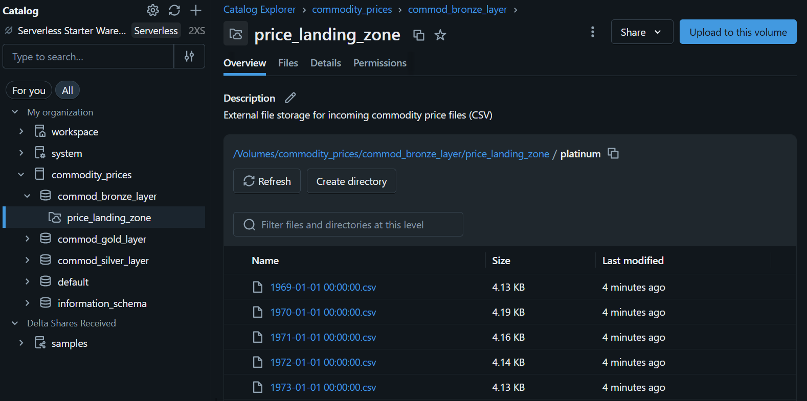

# Commodities Prcicing

This project of mine is more into understanding the details of data warehousing with 
apache Spark (with PySpark) and Delta lake. 

I am considering various commodities and their associated prices to build this simple data engineering and reporting project. 

More details would be added on the fly as I proceed with the project. 

**UPDATE 1** : The local system was frying my system, hence swithced to databricks free edition. Using DAB for this project. 

**UPDATE 2** : The raw files I had were huge files containing years of daily price data. For more easier simulation of real world I broke them into yearly files and added them to the 
volume of the bornze layer. 

Thanks. Give it a star if you like it. Cheers. 

Manas